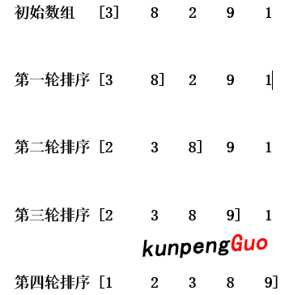

# 排序

## 冒泡排序

原理: 从左到右依次比较相邻数据的大小, 在一轮的循环之后, 可以将最大(小)值上浮到右侧。
在一轮循环中，如果没有发生交换，那么说明数组已经是有序的，此时可以直接退出。

eg: [6, 3, 8, 2, 9, 1]
第一轮排序: 
- 第一次比较 6和3比较 结果:  3 6 8 2 9 1
- ...
- 第五次比较 9和1比较 结果:  3 6 2 8 1 9

第二轮排序: 
- ... 第一次排序中已经把最大值9上浮到最右侧, 只需四次比较即可
- 第四次比较 8和1比较 结果:  3 2 6 1 8 9

...

第五轮排序: 
- 第一次比较 2和1比较 结果:  1 2 3 6 8 9

总结: 对于长度为N的数组, 需要排需N-1轮, 每i轮比较N-i次
代码实现: 可以使用双重循环语句, 外层循环控制循环轮次, 内层循环控制每轮的比较次数
```php
public function bubbleSort($arr) {
    $N = count($arr);
    for ($i = 0; $i < $N - 1; $i++) {
        // 控制循环伦次
        for ($j = 0; $j < $N - $i - 1; $j++) {
            // 控制每轮比较次数
            if ($arr[$j] > $arr[$j+1]) {
                // 比较相邻两个数的大小, 替换位置
                $temp = $arr[$j];
                $arr[$j] = $arr[$j+1];
                $arr[$j+1] = $temp;
            }
        }
    }
    return $arr;
}
```

## 选择排序

原理: 在数组中选择最小元素(第一个与后面几个依次比较找到最小的那个), 将它与数组中第一个元素交换位置。再从数组剩下的元素中找到最小数与第二位交换位置。如此循环到倒数第二个数和最后一个数比较为止。

选择排序需要 \~N<sup>2</sup>/2 次比较和 \~N 次交换，它的运行时间与输入无关，这个特点使得它对一个已经排序的数组也需要这么多的比较和交换操作。

eg: [6, 3, 8, 2, 9, 1]
第一轮排序: 
- 第一次比较 6 与 (3, 8, 2, 9, 1)中 3比较, 当前最小为3, 位置为1
- 第二次比较 3 与 (3, 8, 2, 9, 1)中 8比较, 当前最小为3, 位置为1
- ...
- 第五次比较 2 与 (3, 8, 2, 9, 1)中 1比较, 当前最小为1, 位置为5
第一轮比较完成后确定最小数为1, 小于第一位数6, 交换位置 结果为: 1 3 8 2 9 6

第二轮排序: 
- ... 第一次排序中已经把最小值1放到了第一位, 只需四次比较即可
- 第四次比较 2 与 (8 2 9 6)中 6比较, 当前最小为2, 位置为3
第一轮比较完成后确定数组中剩余最小数为2, 小于第二位数3, 交换位置 结果为: 1 2 8 3 9 6

...

第五轮排序: 
- 第一次比较 8 与 (9)中9 比较, 当前最小为8, 位置为5, 交换位置 结果为: 1 2 3 6 8 9

总结: 每轮比较都可以确定一个位置, 对于N个数, 比较N-1轮可以确定N个位置上的数
代码实现: 可以使用双重循环语句, 外层循环控制n位, 内层循环控制外层第n位与数组后面元素依次比较, 找出最小元素的位置
```php
public function selectSort($arr) {
    $N = count($arr);
    for ($i = 0; $i < $N - 1; $i++) {
        // 定义最小位置
        $minIndex = $i;
        for ($j = $i + 1; $j < $N; $j++) {
            if ($arr[$j] < $arr[$minIndex]) {
                $minIndex = $j;
            }
        }
        if ($i != $minIndex) {
            $temp = $arr[$i];
            $arr[$i] = $arr[$minIndex];
            $arr[$minIndex] = $temp;
        }
    }
    return $arr;
}
```

## 插入排序

原理: 将数组分为两个区(已排序区和未排序区), 每次都将当前元素插入到左侧已排序区, 使得插入之后的左侧数组依然有序

<div align="center">  </div><br>

代码实现: 可以使用双重循环语句, 外层循环控制n位, n位左边未已排序数组, 内层循环控制外层第n位与数组左边元素依次比较, 插入到对应位置
```php
public function insertSort($arr) {
    $N = count($arr);
    for ($i = 1; $i < $N; $i++) {
        $temp = $arr[$i];// 设置哨兵
        for ($j = $i-1; $j >= 0; $j--) {
            if ($temp < $arr[$j]) {
                $arr[$j+1] = $arr[$j];
                $arr[$j] = $temp;
            }
        }
    }
    return $arr;
}
```
